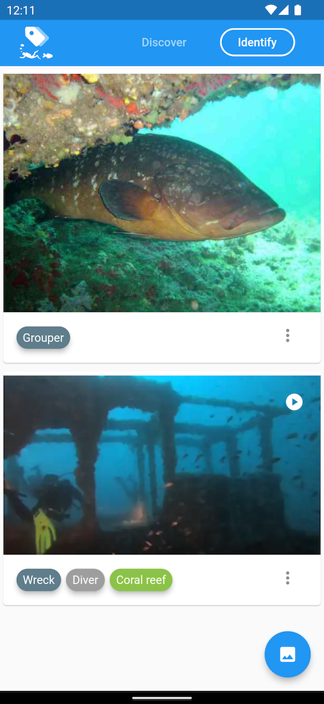

# Sea Life IDentification

After your dive, automatically identify marine life from your underwater photos and videos.
The processing is performed locally on the device.
More than 50 categories : diver, wreck, jellyfish, grouper, ...

You can also report a detection problem from the app to help us improving our automatic tagging.




## Dev

### To regenerate mobx file
```
flutter packages pub run build_runner build --delete-conflicting-outputs
```
More info: https://pub.dev/packages/mobx_codegen#-readme-tab-


### To generate bundle
```
flutter build appbundle --flavor "prod"
```
More info: https://flutter.dev/docs/deployment/android

### To check deps
```
flutter pub run dependency_validator
```
